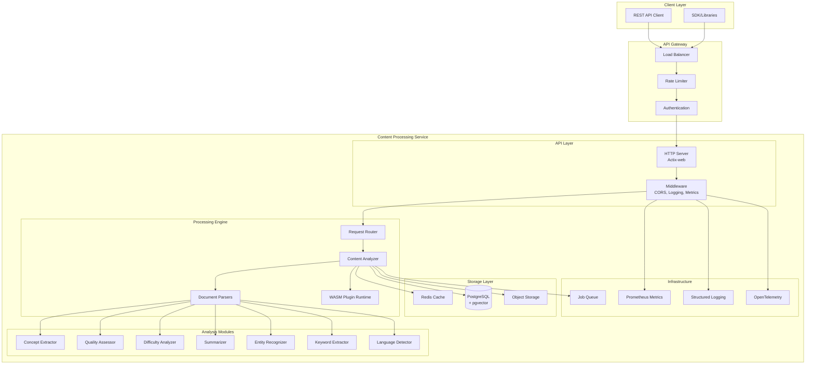
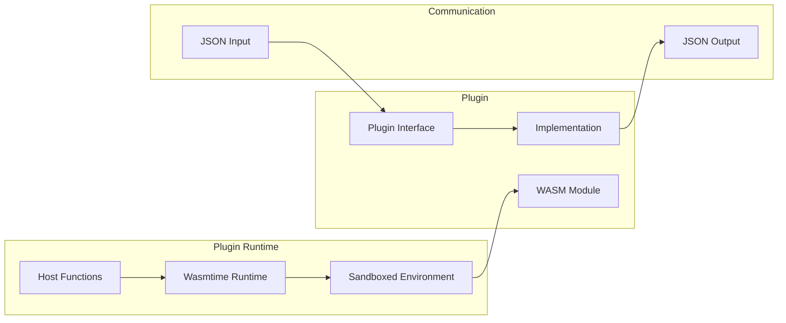

# Content Processing Service Architecture

## System Overview

The Content Processing Service is designed as a high-performance, scalable microservice that handles document analysis and content extraction. It follows a modular architecture with clear separation of concerns.



## Component Breakdown

### API Layer

The API layer handles HTTP requests using Actix-web, providing:

- **RESTful Endpoints**: Clean API design following REST principles
- **Request Validation**: Input validation and sanitization
- **Response Formatting**: Consistent JSON response structure
- **Error Handling**: Comprehensive error responses with proper HTTP codes

```rust
// Example from src/api.rs
pub async fn process_content(
    payload: web::Json<ProcessRequest>,
) -> actix_web::Result<HttpResponse> {
    // Validate input
    // Route to processor
    // Return formatted response
}
```

### Processing Engine

The core processing engine orchestrates document analysis:

1. **Request Router**: Directs requests based on content type and options
2. **Content Analyzer**: Coordinates analysis modules
3. **Document Parsers**: Extract text and structure from various formats
4. **Plugin Runtime**: Executes WASM plugins in sandboxed environment

### Analysis Modules

Each analysis module is independently developed and tested:

- **Concept Extraction** (`src/analysis/concepts.rs`): Uses NLP to identify key concepts
- **Quality Assessment** (`src/analysis/quality.rs`): Evaluates content quality metrics
- **Difficulty Analysis** (`src/analysis/difficulty.rs`): Assesses complexity levels
- **Summarization** (`src/analysis/summarization.rs`): Generates concise summaries
- **Entity Recognition** (`src/analysis/entities.rs`): Extracts named entities
- **Keyword Extraction** (`src/analysis/keywords.rs`): Identifies important terms
- **Language Detection** (`src/analysis/language.rs`): Detects content language

## Database Schema

### Content Metadata Table

```sql
CREATE TABLE content_metadata (
    id UUID PRIMARY KEY,
    title TEXT NOT NULL,
    source_url TEXT,
    content_type VARCHAR(50) NOT NULL,
    format VARCHAR(50) NOT NULL,
    size_bytes BIGINT,
    hash VARCHAR(64) NOT NULL,
    quality_score FLOAT,
    difficulty_level VARCHAR(20),
    concepts JSONB DEFAULT '[]'::jsonb,
    embeddings vector(1536),  -- pgvector for similarity search
    created_at TIMESTAMPTZ NOT NULL DEFAULT NOW(),
    updated_at TIMESTAMPTZ NOT NULL DEFAULT NOW()
);
```

### Processing Jobs Table

```sql
CREATE TABLE processing_jobs (
    id UUID PRIMARY KEY,
    content_id UUID REFERENCES content_metadata(id),
    job_type VARCHAR(50) NOT NULL,
    status job_status NOT NULL DEFAULT 'pending',
    priority job_priority NOT NULL DEFAULT 'medium',
    options JSONB DEFAULT '{}'::jsonb,
    result JSONB,
    error_message TEXT,
    retry_count INT DEFAULT 0,
    worker_id VARCHAR(100),
    started_at TIMESTAMPTZ,
    completed_at TIMESTAMPTZ,
    created_at TIMESTAMPTZ NOT NULL DEFAULT NOW()
);
```

### Plugin Registry Table

```sql
CREATE TABLE plugin_registry (
    id UUID PRIMARY KEY,
    name VARCHAR(255) UNIQUE NOT NULL,
    version VARCHAR(50) NOT NULL,
    description TEXT,
    wasm_module BYTEA NOT NULL,
    metadata JSONB DEFAULT '{}'::jsonb,
    enabled BOOLEAN DEFAULT true,
    created_at TIMESTAMPTZ NOT NULL DEFAULT NOW()
);
```

## Redis Caching Strategy

The service uses Redis for multiple caching layers:

### 1. Result Caching
- **Key Pattern**: `content:result:{content_hash}:{options_hash}`
- **TTL**: 1 hour for frequently accessed, 24 hours for others
- **Eviction**: LRU when memory limit reached

### 2. Plugin Output Caching
- **Key Pattern**: `plugin:{plugin_name}:{version}:{content_hash}`
- **TTL**: 30 minutes
- **Purpose**: Avoid re-running expensive plugin operations

### 3. Session Caching
- **Key Pattern**: `session:{session_id}:state`
- **TTL**: 15 minutes, extended on access
- **Purpose**: Maintain processing state across requests

### 4. Rate Limiting
- **Key Pattern**: `ratelimit:{client_id}:{window}`
- **TTL**: Based on window size (minute/hour/day)
- **Purpose**: Prevent API abuse

## WASM Plugin Architecture

The plugin system allows extending functionality without modifying core code:



### Plugin Interface

```rust
// Plugins must implement this interface
trait ContentPlugin {
    fn process(&self, input: PluginInput) -> Result<PluginOutput>;
    fn metadata(&self) -> PluginMetadata;
    fn validate_input(&self, input: &PluginInput) -> Result<()>;
}
```

### Security Isolation

- **Memory Limits**: Each plugin has configurable memory limits
- **CPU Limits**: Execution time bounded by timeout
- **No Network Access**: Plugins cannot make external calls
- **No File System**: Only provided data accessible

## Performance Optimizations

### 1. Connection Pooling
- PostgreSQL: 20 connections (configurable)
- Redis: 10 connections (configurable)

### 2. Batch Processing
- Groups similar requests for efficient processing
- Configurable batch size (default: 100)

### 3. Parallel Analysis
- Each analysis module runs concurrently
- Results aggregated asynchronously

### 4. Zero-Copy Parsing
- Uses memory-mapped files for large documents
- Streaming parsers for unbounded content

## Monitoring and Observability

### Metrics (Prometheus)

- `content_processing_requests_total`: Request counter
- `content_processing_duration_seconds`: Processing time histogram
- `content_processing_errors_total`: Error counter by type
- `plugin_execution_duration_seconds`: Plugin performance
- `cache_hit_rate`: Cache effectiveness

### Logging

Structured JSON logging with correlation IDs:

```json
{
  "timestamp": "2023-12-09T10:30:00Z",
  "level": "INFO",
  "correlation_id": "123e4567-e89b-12d3-a456-426614174000",
  "service": "content_processing",
  "message": "Processing completed",
  "content_type": "pdf",
  "processing_time_ms": 250
}
```

### Distributed Tracing

OpenTelemetry integration tracks requests across services:

- Trace processing pipeline
- Identify bottlenecks
- Monitor plugin performance

## Scalability Considerations

### Horizontal Scaling
- Stateless design allows multiple instances
- Load balanced by content type or hash
- Shared cache and database

### Vertical Scaling
- Memory: Increases processing capacity
- CPU: Improves analysis speed
- Disk: For temporary file processing

### Resource Limits
- Max content size: 10MB (configurable)
- Max processing time: 30s (configurable)
- Max concurrent jobs: 100 (configurable)

## Security Architecture

### Input Validation
- Content type verification
- Size limits enforcement
- Malicious content detection

### Plugin Sandboxing
- WASM isolation
- Resource limits
- No system access

### Data Protection
- Encryption at rest (PostgreSQL)
- Encryption in transit (TLS)
- PII detection and masking

## Deployment Patterns

### Docker Deployment
- Multi-stage build for minimal size
- Non-root user execution
- Health checks included

### Kubernetes Deployment
- Horizontal Pod Autoscaling
- Resource limits defined
- Liveness/readiness probes

### Database Migration
- Automatic migration on startup
- Rollback capability
- Zero-downtime updates