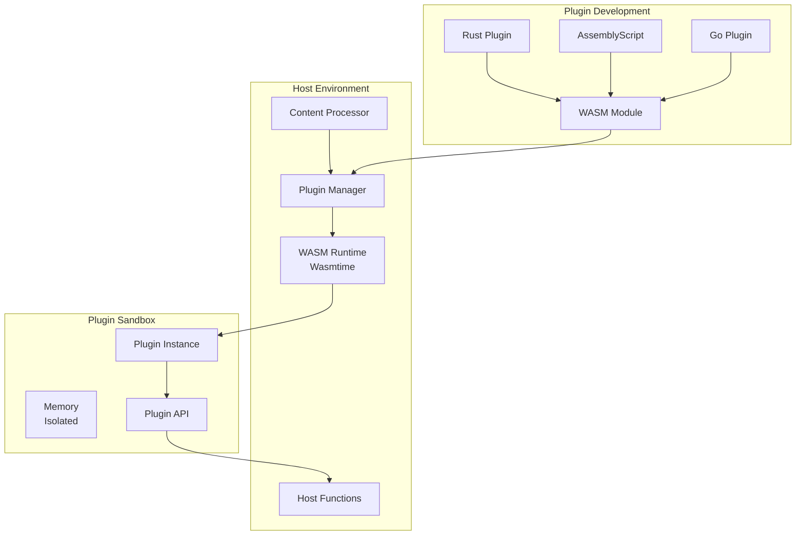

# Content Processing Plugin Development Guide

## Overview

The Content Processing Service supports WebAssembly (WASM) plugins to extend its functionality. Plugins run in a secure, sandboxed environment and can process content, extract custom data, or enhance existing analysis capabilities.

## Plugin Architecture



## Plugin Interface

All plugins must implement the following interface:

```rust
// Plugin trait that all plugins must implement
#[wasm_bindgen]
pub trait ContentPlugin {
    /// Process content and return results
    fn process(&self, input: PluginInput) -> Result<PluginOutput, PluginError>;
    
    /// Return plugin metadata
    fn metadata(&self) -> PluginMetadata;
    
    /// Validate input before processing
    fn validate_input(&self, input: &PluginInput) -> Result<(), ValidationError>;
    
    /// Initialize plugin with configuration
    fn initialize(&mut self, config: HashMap<String, Value>) -> Result<(), InitError>;
}
```

### Input/Output Structures

```rust
// Input provided to plugins
#[derive(Serialize, Deserialize)]
pub struct PluginInput {
    pub content: String,
    pub content_type: ContentType,
    pub metadata: ContentMetadata,
    pub context: HashMap<String, Value>,
}

// Output returned by plugins
#[derive(Serialize, Deserialize)]
pub struct PluginOutput {
    pub modified_content: Option<String>,
    pub extracted_data: HashMap<String, Value>,
    pub metadata_updates: HashMap<String, Value>,
    pub processing_time_ms: u64,
}
```

## Creating a Plugin

### 1. Rust Plugin Example

Create a new Rust project for your plugin:

```bash
cargo new --lib sentiment_analyzer_plugin
cd sentiment_analyzer_plugin
```

Update `Cargo.toml`:

```toml
[package]
name = "sentiment_analyzer_plugin"
version = "0.1.0"
edition = "2021"

[lib]
crate-type = ["cdylib"]

[dependencies]
wasm-bindgen = "0.2"
serde = { version = "1.0", features = ["derive"] }
serde_json = "1.0"

[dependencies.web-sys]
version = "0.3"
```

Implement the plugin in `src/lib.rs`:

```rust
use wasm_bindgen::prelude::*;
use serde::{Deserialize, Serialize};
use std::collections::HashMap;

#[wasm_bindgen]
pub struct SentimentAnalyzer {
    config: HashMap<String, serde_json::Value>,
}

#[wasm_bindgen]
impl SentimentAnalyzer {
    #[wasm_bindgen(constructor)]
    pub fn new() -> Self {
        Self {
            config: HashMap::new(),
        }
    }

    pub fn process(&self, input_json: &str) -> Result<String, JsValue> {
        // Parse input
        let input: PluginInput = serde_json::from_str(input_json)
            .map_err(|e| JsValue::from_str(&e.to_string()))?;
        
        // Perform sentiment analysis
        let sentiment = self.analyze_sentiment(&input.content);
        
        // Create output
        let mut extracted_data = HashMap::new();
        extracted_data.insert(
            "sentiment".to_string(),
            serde_json::json!({
                "score": sentiment.score,
                "label": sentiment.label,
                "confidence": sentiment.confidence
            })
        );
        
        let output = PluginOutput {
            modified_content: None,
            extracted_data,
            metadata_updates: HashMap::new(),
            processing_time_ms: 10,
        };
        
        // Serialize output
        serde_json::to_string(&output)
            .map_err(|e| JsValue::from_str(&e.to_string()))
    }
    
    pub fn metadata(&self) -> String {
        let metadata = PluginMetadata {
            name: "sentiment_analyzer".to_string(),
            version: "0.1.0".to_string(),
            description: "Analyzes sentiment of text content".to_string(),
            author: "Your Name".to_string(),
            supported_content_types: vec!["PlainText", "Html", "Markdown"],
            required_permissions: vec![],
            configuration_schema: Some(serde_json::json!({
                "type": "object",
                "properties": {
                    "model": {
                        "type": "string",
                        "default": "basic"
                    },
                    "threshold": {
                        "type": "number",
                        "minimum": 0.0,
                        "maximum": 1.0,
                        "default": 0.5
                    }
                }
            })),
        };
        
        serde_json::to_string(&metadata).unwrap()
    }
    
    fn analyze_sentiment(&self, text: &str) -> SentimentResult {
        // Simple sentiment analysis logic
        let positive_words = ["good", "great", "excellent", "amazing", "wonderful"];
        let negative_words = ["bad", "terrible", "awful", "horrible", "poor"];
        
        let text_lower = text.to_lowercase();
        let positive_count = positive_words.iter()
            .filter(|word| text_lower.contains(word))
            .count();
        let negative_count = negative_words.iter()
            .filter(|word| text_lower.contains(word))
            .count();
        
        let total = positive_count + negative_count;
        if total == 0 {
            return SentimentResult {
                score: 0.0,
                label: "neutral".to_string(),
                confidence: 0.5,
            };
        }
        
        let score = (positive_count as f32 - negative_count as f32) / total as f32;
        let label = if score > 0.2 {
            "positive"
        } else if score < -0.2 {
            "negative"
        } else {
            "neutral"
        };
        
        SentimentResult {
            score,
            label: label.to_string(),
            confidence: 0.7 + (score.abs() * 0.3),
        }
    }
}

#[derive(Serialize)]
struct SentimentResult {
    score: f32,
    label: String,
    confidence: f32,
}

// Define structures (same as host)
#[derive(Deserialize)]
struct PluginInput {
    content: String,
    content_type: String,
    metadata: serde_json::Value,
    context: HashMap<String, serde_json::Value>,
}

#[derive(Serialize)]
struct PluginOutput {
    modified_content: Option<String>,
    extracted_data: HashMap<String, serde_json::Value>,
    metadata_updates: HashMap<String, serde_json::Value>,
    processing_time_ms: u64,
}

#[derive(Serialize)]
struct PluginMetadata {
    name: String,
    version: String,
    description: String,
    author: String,
    supported_content_types: Vec<String>,
    required_permissions: Vec<String>,
    configuration_schema: Option<serde_json::Value>,
}
```

Build the plugin:

```bash
# Install wasm-pack if not already installed
cargo install wasm-pack

# Build the WASM module
wasm-pack build --target web --out-dir pkg
```

### 2. AssemblyScript Plugin Example

Create an AssemblyScript plugin:

```typescript
// readability-plugin.ts
import { JSON } from "assemblyscript-json";

export class ReadabilityPlugin {
  process(inputJson: string): string {
    const input = <JSON.Obj>JSON.parse(inputJson);
    const content = input.getString("content")!.valueOf();
    
    // Calculate readability metrics
    const metrics = this.calculateReadability(content);
    
    // Create output
    const output = new JSON.Obj();
    const extractedData = new JSON.Obj();
    extractedData.set("readability", metrics);
    
    output.set("modified_content", JSON.Null());
    output.set("extracted_data", extractedData);
    output.set("metadata_updates", new JSON.Obj());
    output.set("processing_time_ms", new JSON.Integer(5));
    
    return output.stringify();
  }
  
  metadata(): string {
    const meta = new JSON.Obj();
    meta.set("name", new JSON.Str("readability_enhancer"));
    meta.set("version", new JSON.Str("0.1.0"));
    meta.set("description", new JSON.Str("Analyzes text readability"));
    
    const types = new JSON.Arr();
    types.push(new JSON.Str("PlainText"));
    types.push(new JSON.Str("Html"));
    meta.set("supported_content_types", types);
    
    return meta.stringify();
  }
  
  private calculateReadability(text: string): JSON.Obj {
    const sentences = text.split(/[.!?]+/).length - 1;
    const words = text.split(/\s+/).length;
    const syllables = this.countSyllables(text);
    
    // Flesch Reading Ease Score
    const score = 206.835 - 1.015 * (words / sentences) - 84.6 * (syllables / words);
    
    const result = new JSON.Obj();
    result.set("flesch_score", new JSON.Float(score));
    result.set("grade_level", new JSON.Str(this.getGradeLevel(score)));
    result.set("sentences", new JSON.Integer(sentences));
    result.set("words", new JSON.Integer(words));
    
    return result;
  }
  
  private countSyllables(text: string): i32 {
    // Simplified syllable counting
    return text.toLowerCase().replace(/[^aeiou]/g, "").length;
  }
  
  private getGradeLevel(score: f64): string {
    if (score >= 90) return "5th grade";
    if (score >= 80) return "6th grade";
    if (score >= 70) return "7th grade";
    if (score >= 60) return "8th-9th grade";
    if (score >= 50) return "10th-12th grade";
    if (score >= 30) return "College";
    return "Graduate";
  }
}

// Export required functions
export function process(input: string): string {
  const plugin = new ReadabilityPlugin();
  return plugin.process(input);
}

export function metadata(): string {
  const plugin = new ReadabilityPlugin();
  return plugin.metadata();
}
```

## Plugin Deployment

### 1. Manual Deployment

Copy the compiled WASM file to the plugin directory:

```bash
cp target/wasm32-unknown-unknown/release/my_plugin.wasm /app/plugins/
```

### 2. API Deployment

Use the plugin management API to deploy plugins:

```bash
curl -X POST http://localhost:8082/plugins \
  -H "Content-Type: application/octet-stream" \
  --data-binary @my_plugin.wasm
```

### 3. Hot Reloading

Plugins can be updated without restarting the service:

```bash
curl -X PUT http://localhost:8082/plugins/my_plugin \
  -H "Content-Type: application/octet-stream" \
  --data-binary @my_plugin_v2.wasm
```

## Plugin Management

### Listing Plugins

```bash
curl http://localhost:8082/plugins
```

Response:
```json
{
  "plugins": [
    {
      "name": "sentiment_analyzer",
      "version": "0.1.0",
      "enabled": true,
      "loaded_at": "2023-12-09T10:30:00Z"
    },
    {
      "name": "readability_enhancer",
      "version": "0.2.0",
      "enabled": true,
      "loaded_at": "2023-12-09T10:31:00Z"
    }
  ]
}
```

### Enabling/Disabling Plugins

```bash
# Disable a plugin
curl -X PATCH http://localhost:8082/plugins/sentiment_analyzer \
  -H "Content-Type: application/json" \
  -d '{"enabled": false}'

# Enable a plugin
curl -X PATCH http://localhost:8082/plugins/sentiment_analyzer \
  -H "Content-Type: application/json" \
  -d '{"enabled": true}'
```

### Configuring Plugins

```bash
curl -X PUT http://localhost:8082/plugins/sentiment_analyzer/config \
  -H "Content-Type: application/json" \
  -d '{
    "model": "advanced",
    "threshold": 0.7,
    "language": "en"
  }'
```

## Performance Considerations

### 1. Memory Usage

Plugins have memory limits to prevent resource exhaustion:

- Default limit: 10MB per plugin instance
- Configurable via `PLUGIN_MEMORY_LIMIT` environment variable
- Monitor memory usage in plugin metrics

### 2. Execution Time

Plugins have execution time limits:

- Default timeout: 10 seconds
- Configurable per plugin in metadata
- Terminated if exceeded

### 3. Optimization Tips

1. **Minimize Allocations**: Reuse buffers when possible
2. **Batch Operations**: Process multiple items together
3. **Cache Results**: Use provided caching mechanisms
4. **Efficient Algorithms**: Choose O(n) over O(n²) when possible

Example optimization:

```rust
// Bad: Multiple allocations
fn process_words(text: &str) -> Vec<String> {
    text.split_whitespace()
        .map(|w| w.to_lowercase())
        .collect()
}

// Good: Single allocation
fn process_words(text: &str) -> Vec<String> {
    let word_count = text.split_whitespace().count();
    let mut words = Vec::with_capacity(word_count);
    for word in text.split_whitespace() {
        words.push(word.to_lowercase());
    }
    words
}
```

## Security Considerations

### 1. Sandboxing

Plugins run in a secure sandbox with:

- No file system access
- No network access
- No system calls
- Limited memory and CPU

### 2. Input Validation

Always validate input in your plugin:

```rust
fn validate_input(&self, input: &PluginInput) -> Result<(), ValidationError> {
    if input.content.is_empty() {
        return Err(ValidationError::EmptyContent);
    }
    
    if input.content.len() > 1_000_000 {
        return Err(ValidationError::ContentTooLarge);
    }
    
    if !self.supported_types.contains(&input.content_type) {
        return Err(ValidationError::UnsupportedType);
    }
    
    Ok(())
}
```

### 3. Error Handling

Handle errors gracefully:

```rust
match self.process_internal(input) {
    Ok(result) => Ok(result),
    Err(e) => {
        // Log error but don't expose internal details
        log::error!("Plugin processing failed: {}", e);
        Err(PluginError::ProcessingFailed)
    }
}
```

## Testing Plugins

### 1. Unit Testing

Test your plugin logic:

```rust
#[cfg(test)]
mod tests {
    use super::*;
    
    #[test]
    fn test_sentiment_analysis() {
        let analyzer = SentimentAnalyzer::new();
        let input = PluginInput {
            content: "This is a great product!".to_string(),
            content_type: "PlainText".to_string(),
            metadata: serde_json::Value::Object(Default::default()),
            context: HashMap::new(),
        };
        
        let result = analyzer.process(&serde_json::to_string(&input).unwrap()).unwrap();
        let output: PluginOutput = serde_json::from_str(&result).unwrap();
        
        assert!(output.extracted_data.contains_key("sentiment"));
        let sentiment = &output.extracted_data["sentiment"];
        assert_eq!(sentiment["label"], "positive");
    }
}
```

### 2. Integration Testing

Test with the host environment:

```bash
# Test plugin locally
cargo run --bin plugin-tester -- my_plugin.wasm test-input.json

# Test with the service
curl -X POST http://localhost:8082/analyze \
  -H "Content-Type: application/json" \
  -d '{
    "content": "Test content",
    "content_type": "PlainText",
    "options": {
      "plugins": ["my_plugin"]
    }
  }'
```

### 3. Performance Testing

Benchmark your plugin:

```rust
#[bench]
fn bench_process(b: &mut Bencher) {
    let plugin = MyPlugin::new();
    let input = create_test_input();
    let input_json = serde_json::to_string(&input).unwrap();
    
    b.iter(|| {
        plugin.process(&input_json).unwrap()
    });
}
```

## Plugin Examples

### 1. Language Detection Plugin

```rust
pub struct LanguageDetector {
    detector: WhichLang::Detector,
}

impl LanguageDetector {
    pub fn process(&self, input: &PluginInput) -> Result<PluginOutput> {
        let lang = self.detector.detect(&input.content)
            .map(|info| info.lang().to_string())
            .unwrap_or_else(|| "unknown".to_string());
        
        let mut data = HashMap::new();
        data.insert("language".to_string(), json!(lang));
        
        Ok(PluginOutput {
            extracted_data: data,
            ..Default::default()
        })
    }
}
```

### 2. Keyword Extraction Plugin

```rust
pub struct KeywordExtractor {
    stop_words: HashSet<String>,
}

impl KeywordExtractor {
    pub fn process(&self, input: &PluginInput) -> Result<PluginOutput> {
        let keywords = self.extract_keywords(&input.content, 10);
        
        let mut data = HashMap::new();
        data.insert("keywords".to_string(), json!(keywords));
        
        Ok(PluginOutput {
            extracted_data: data,
            ..Default::default()
        })
    }
    
    fn extract_keywords(&self, text: &str, limit: usize) -> Vec<String> {
        // TF-IDF or similar algorithm
        // Implementation details...
    }
}
```

### 3. Content Enhancer Plugin

```rust
pub struct ContentEnhancer {
    rules: Vec<EnhancementRule>,
}

impl ContentEnhancer {
    pub fn process(&self, input: &PluginInput) -> Result<PluginOutput> {
        let mut enhanced = input.content.clone();
        
        for rule in &self.rules {
            enhanced = rule.apply(&enhanced);
        }
        
        Ok(PluginOutput {
            modified_content: Some(enhanced),
            ..Default::default()
        })
    }
}
```

## Troubleshooting

### Common Issues

1. **Plugin fails to load**
   - Check WASM file is valid
   - Verify metadata() function exists
   - Check for missing exports

2. **Plugin crashes**
   - Add proper error handling
   - Check memory usage
   - Validate all inputs

3. **Poor performance**
   - Profile the plugin
   - Reduce allocations
   - Use efficient algorithms

4. **Incorrect results**
   - Test edge cases
   - Validate logic
   - Check data transformations

### Debug Mode

Enable plugin debug logging:

```bash
PLUGIN_DEBUG=true cargo run
```

View plugin logs:

```bash
curl http://localhost:8082/plugins/my_plugin/logs
```

## Best Practices

1. **Keep plugins focused**: One plugin, one responsibility
2. **Version properly**: Use semantic versioning
3. **Document thoroughly**: Include usage examples
4. **Test extensively**: Unit, integration, and performance tests
5. **Handle errors gracefully**: Never panic in production
6. **Monitor performance**: Track execution time and memory
7. **Update regularly**: Keep dependencies current