# Knowledge Graph Service Architecture

## System Overview

The Knowledge Graph Service is a high-performance microservice that manages concept relationships and learning paths using Dgraph as the primary graph database. The architecture is designed for scalability, reliability, and performance.

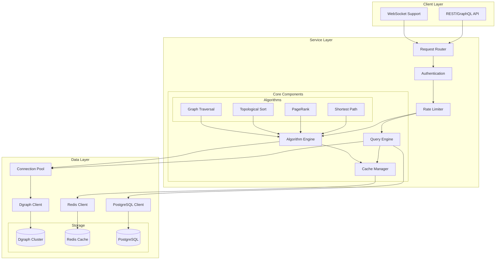

## Dgraph Cluster Architecture

### Single-Node Development Setup

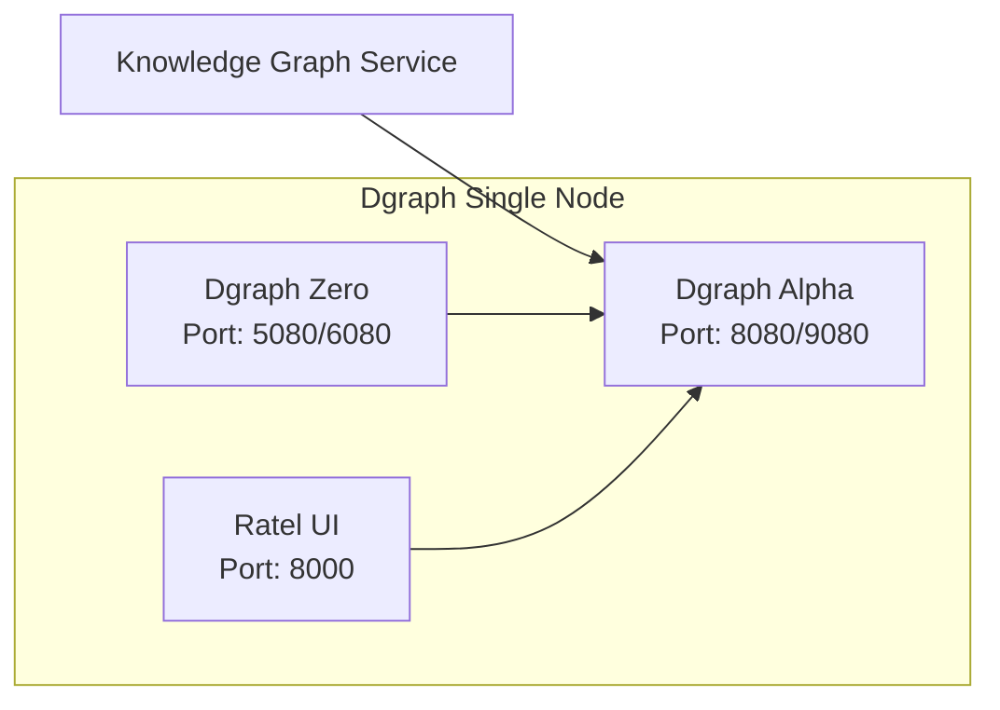

### Production Multi-Node Setup

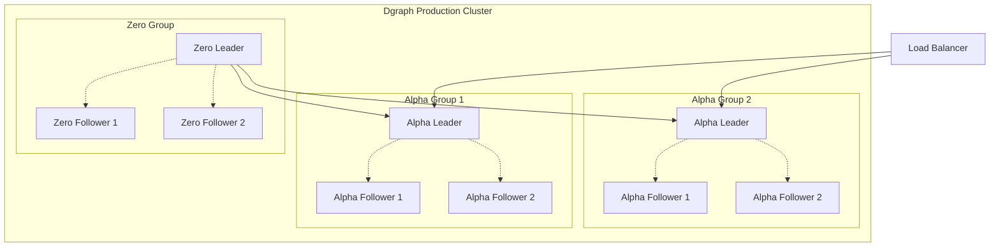

## Connection Pooling Strategy

The service implements a sophisticated connection pooling mechanism to optimize Dgraph interactions:

### Pool Architecture

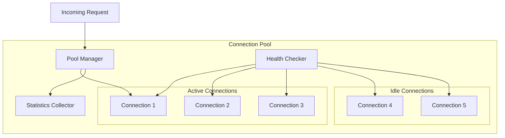

### Connection Lifecycle

1. **Connection Creation**: New connections created on demand up to max pool size
2. **Health Checking**: Background task validates connections every 30 seconds
3. **Connection Recycling**: Idle connections closed after timeout
4. **Retry Logic**: Exponential backoff for failed operations
5. **Statistics Tracking**: Performance metrics for monitoring

## Caching Layer Design

### Multi-Level Caching Strategy

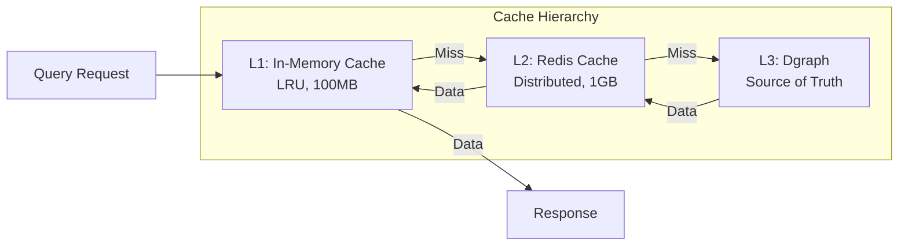

### Cache Invalidation

- **TTL-based**: Automatic expiration after configurable time
- **Event-based**: Invalidation on concept updates
- **Manual**: API endpoints for cache clearing
- **Partial**: Selective invalidation by category/tag

## Graph Algorithm Implementations

### Algorithm Processing Pipeline

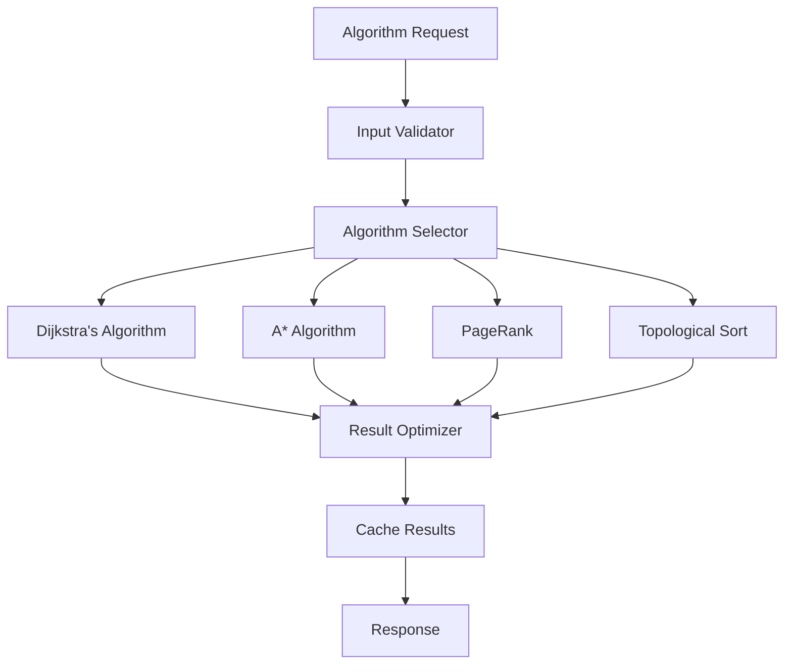

### Algorithm Complexity

| Algorithm | Time Complexity | Space Complexity | Use Case |
|-----------|----------------|------------------|----------|
| Dijkstra | O((V + E) log V) | O(V) | Optimal learning paths |
| A* | O((V + E) log V) | O(V) | Heuristic-guided paths |
| PageRank | O(k(V + E)) | O(V) | Concept importance |
| DFS/BFS | O(V + E) | O(V) | Graph exploration |
| Topological Sort | O(V + E) | O(V) | Prerequisite ordering |

## Data Flow Architecture

### Query Processing Flow

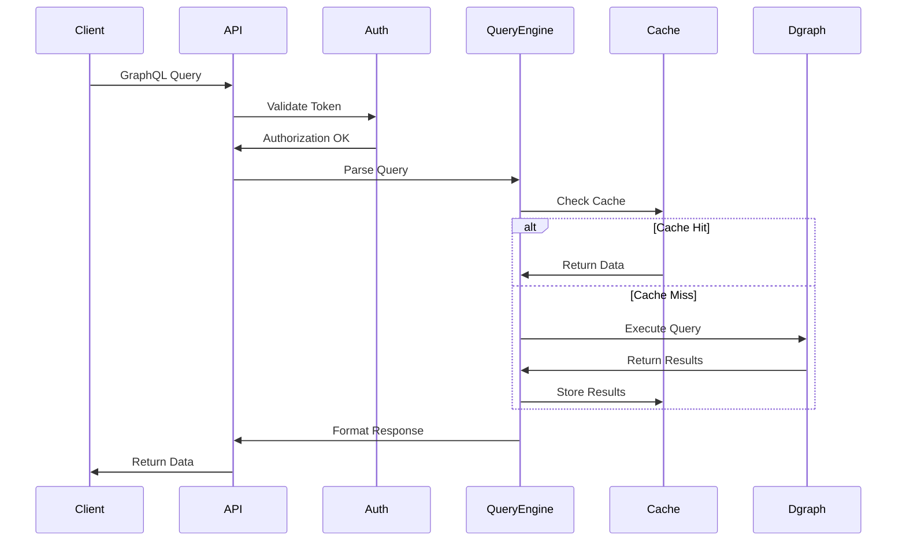

### Learning Path Generation Flow

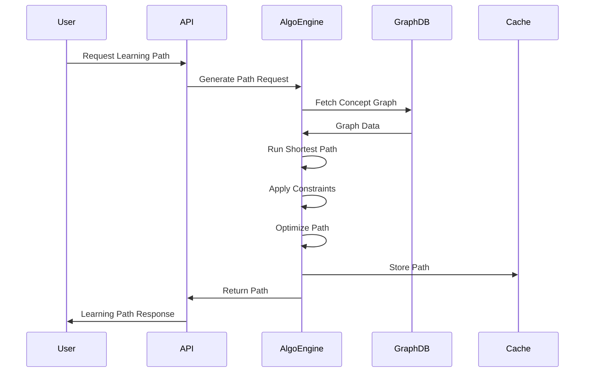

## Security Architecture

### Authentication & Authorization

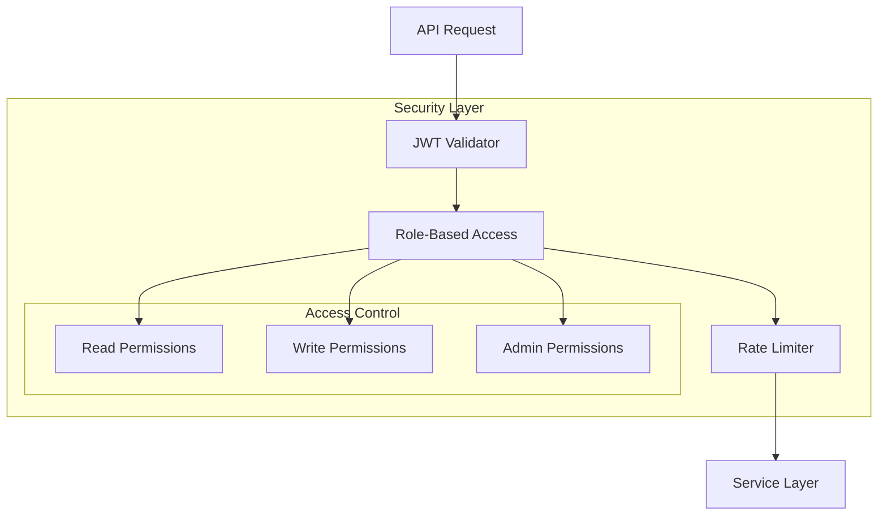

## Performance Optimizations

### Query Optimization Strategies

1. **Index Management**
   - Full-text search indexes on name, description
   - Exact match indexes on category, difficulty
   - Vector indexes for similarity search

2. **Query Planning**
   - Query cost estimation
   - Automatic query rewriting
   - Parallel query execution

3. **Batch Operations**
   - Bulk concept creation
   - Batch relationship updates
   - Transaction batching

### Memory Management

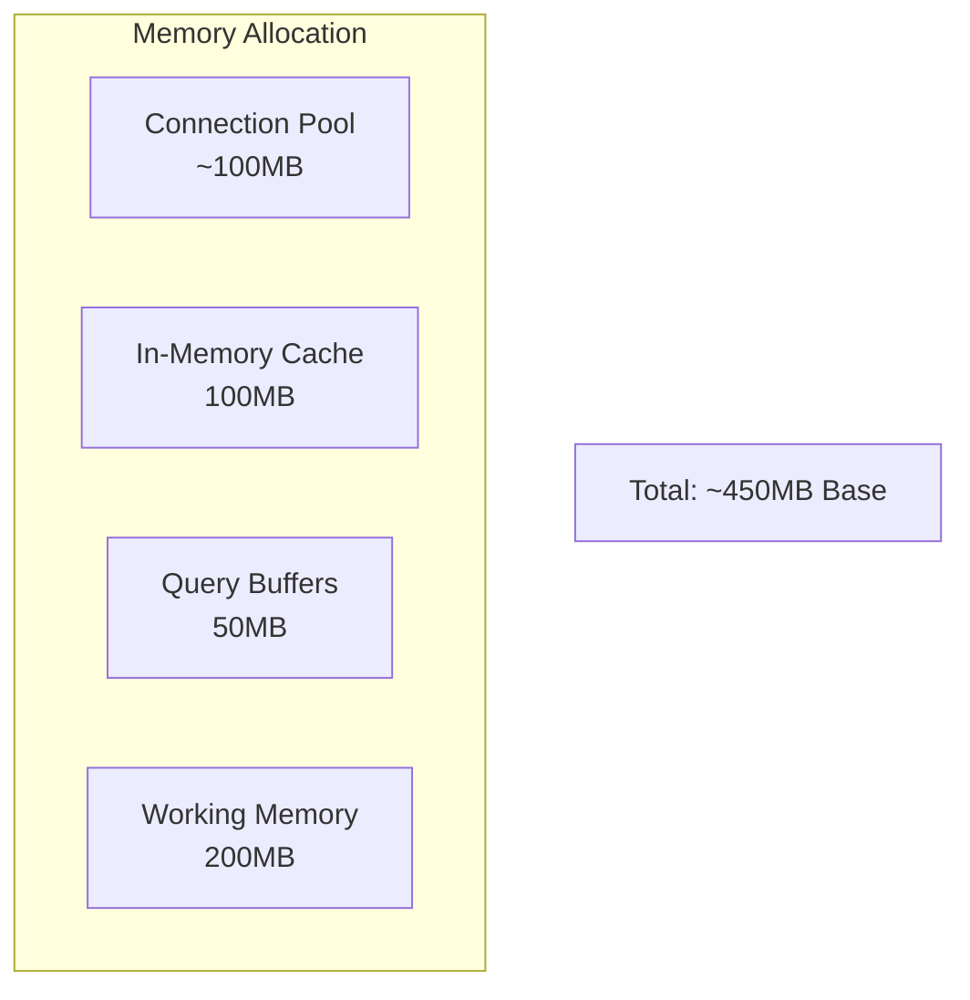

## Monitoring & Observability

### Metrics Collection

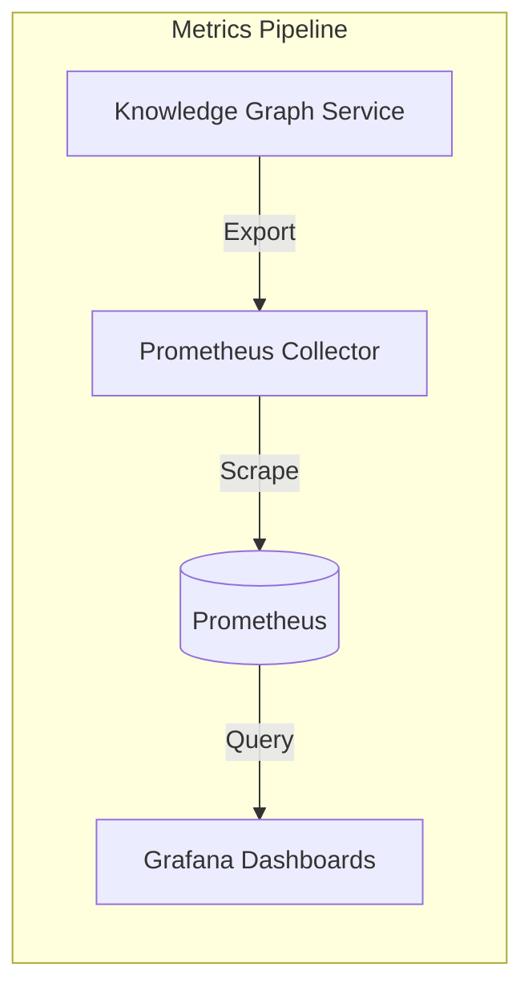

### Key Metrics

- **Performance Metrics**
  - Query latency (p50, p95, p99)
  - Algorithm execution time
  - Cache hit/miss ratio
  - Connection pool utilization

- **Business Metrics**
  - Concepts created/updated
  - Learning paths generated
  - Search queries processed
  - Active user sessions

- **System Metrics**
  - CPU and memory usage
  - Network I/O
  - Dgraph cluster health
  - Error rates by type

## Deployment Architecture

### Kubernetes Deployment

```yaml
apiVersion: apps/v1
kind: Deployment
metadata:
  name: knowledge-graph-service
spec:
  replicas: 3
  selector:
    matchLabels:
      app: knowledge-graph
  template:
    spec:
      containers:
      - name: service
        image: knowledge-graph:latest
        resources:
          requests:
            memory: "512Mi"
            cpu: "500m"
          limits:
            memory: "1Gi"
            cpu: "1000m"
```

### Service Mesh Integration

The service is designed to work within a service mesh (Istio/Linkerd) for:
- Automatic mTLS
- Circuit breaking
- Load balancing
- Distributed tracing

## Scalability Considerations

### Horizontal Scaling

- **Service Instances**: Stateless design allows linear scaling
- **Dgraph Cluster**: Add Alpha nodes for read scaling
- **Cache Layer**: Redis cluster for distributed caching
- **Load Balancing**: Round-robin with health checks

### Vertical Scaling

- **Connection Pool**: Increase max connections
- **Cache Size**: Expand in-memory and Redis cache
- **Algorithm Workers**: More concurrent algorithm executions
- **Query Complexity**: Tune for larger graphs

## Failure Handling

### Resilience Patterns

1. **Circuit Breaker**: Prevent cascading failures
2. **Retry with Backoff**: Handle transient errors
3. **Fallback Mechanisms**: Degraded service options
4. **Health Checks**: Proactive failure detection
5. **Graceful Degradation**: Partial service availability

### Recovery Procedures

- Automatic connection pool recovery
- Cache rebuild on corruption
- Transaction rollback support
- Point-in-time recovery from backups