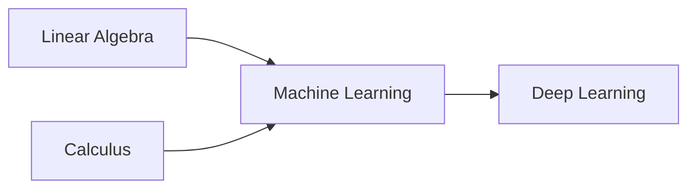
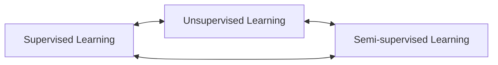
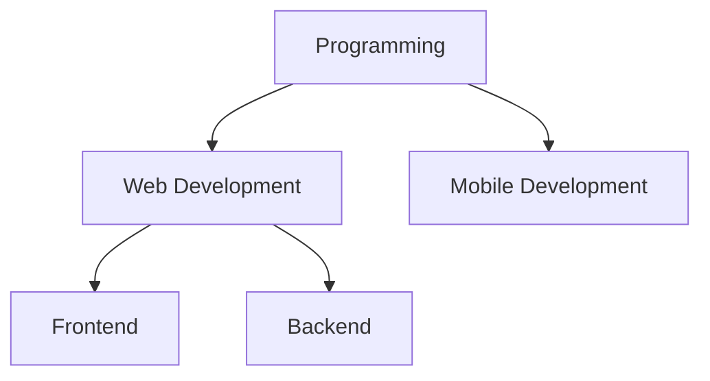

# Knowledge Graph Schema Documentation

## Overview

The Knowledge Graph uses Dgraph's native GraphQL schema to define the structure of concepts, relationships, and learning paths. The schema is designed for flexibility, performance, and rich querying capabilities.

## Core Types

### Concept

The fundamental unit of knowledge in the graph.

```graphql
type Concept {
  # Unique identifier
  id: ID!
  
  # Core attributes
  name: String! @search(by: [exact, term, fulltext])
  description: String @search(by: [fulltext])
  difficulty: String @search(by: [exact])
  category: String! @search(by: [exact, term])
  subcategory: String @search(by: [exact, term])
  tags: [String] @search(by: [exact])
  
  # Relationships
  prerequisites: [Concept] @hasInverse(field: enabledBy)
  enabledBy: [Concept] @hasInverse(field: prerequisites)
  relatedTo: [Concept]
  subtopics: [Concept] @hasInverse(field: parentTopic)
  parentTopic: Concept @hasInverse(field: subtopics)
  
  # Associated data
  resources: [LearningResource]
  embedding: [Float!] @search
  
  # Metrics
  qualityScore: Float @search
  estimatedTime: Float
  
  # Metadata
  createdAt: DateTime! @search
  updatedAt: DateTime! @search
  version: Int!
}
```

#### Field Descriptions

| Field | Type | Description | Indexed |
|-------|------|-------------|---------|
| `id` | ID | UUID v4 identifier | Yes |
| `name` | String | Human-readable concept name | Full-text, Term, Exact |
| `description` | String | Detailed explanation | Full-text |
| `difficulty` | String | One of: beginner, intermediate, advanced, expert | Exact |
| `category` | String | Primary domain (e.g., programming, mathematics) | Exact, Term |
| `subcategory` | String | Secondary classification | Exact, Term |
| `tags` | [String] | Flexible categorization | Exact |
| `qualityScore` | Float | 0.0-1.0 quality metric | Range |
| `estimatedTime` | Float | Hours to learn | Range |
| `embedding` | [Float] | 768-dim vector for similarity | Vector |

### LearningResource

Educational content associated with concepts.

```graphql
type LearningResource {
  id: ID!
  
  # Resource identification
  url: String! @search(by: [exact])
  title: String! @search(by: [term, fulltext])
  
  # Classification
  resourceType: String! @search(by: [exact])
  format: String @search(by: [exact])
  source: String @search(by: [exact])
  
  # Quality metrics
  quality: Float @search
  difficulty: String @search(by: [exact])
  duration: Int  # minutes
  
  # Localization
  language: String @search(by: [exact])
  
  # Relationships
  concepts: [Concept] @hasInverse(field: resources)
  
  # Metadata
  createdAt: DateTime! @search
  updatedAt: DateTime! @search
}
```

#### Resource Types

- `video` - Video tutorials
- `article` - Written guides
- `course` - Full courses
- `book` - Textbooks/ebooks
- `interactive` - Hands-on labs
- `documentation` - Reference docs
- `podcast` - Audio content

### LearningPath

Curated sequences of concepts for structured learning.

```graphql
type LearningPath {
  id: ID!
  
  # Path information
  name: String! @search(by: [exact, term, fulltext])
  description: String @search(by: [fulltext])
  targetAudience: String @search(by: [term])
  
  # Structure
  concepts: [PathConcept!]
  estimatedTime: Float
  difficultyProgression: String
  
  # Outcomes
  learningOutcomes: [String]
  
  # Attribution
  creator: String
  isCustom: Boolean!
  
  # Metadata
  createdAt: DateTime! @search
  updatedAt: DateTime! @search
}
```

### PathConcept

Represents a concept within a learning path with ordering.

```graphql
type PathConcept {
  concept: Concept!
  order: Int!
  isOptional: Boolean!
  alternativeConcepts: [Concept]
}
```

### UserProgress

Tracks individual learning progress.

```graphql
type UserProgress {
  id: ID!
  
  # Identification
  userId: String! @search(by: [exact])
  concept: Concept!
  
  # Progress tracking
  status: String! @search(by: [exact])
  percentComplete: Float
  timeSpent: Int  # minutes
  resourcesCompleted: Int
  
  # Feedback
  difficultyRating: Float
  notes: String
  
  # Timestamps
  startedAt: DateTime
  completedAt: DateTime
  lastAccessedAt: DateTime! @search
}
```

#### Progress Status Values

- `not_started` - Concept identified but not begun
- `in_progress` - Active learning
- `completed` - Finished learning
- `mastered` - Demonstrated expertise

## Relationship Types

### Prerequisites (Directed)

Represents learning dependencies between concepts.



**Properties:**
- Directed edge from prerequisite to dependent
- No cycles allowed (enforced by algorithms)
- Transitive relationships computed

### Related Concepts (Bidirectional)

Represents conceptual similarity or relevance.



**Properties:**
- Bidirectional relationship
- Similarity score can be attached
- Used for recommendations

### Parent-Child (Hierarchical)

Represents topic hierarchy.



**Properties:**
- Tree structure (one parent per concept)
- Enables categorical navigation
- Inheritance of properties

## Index Strategies

### Search Indexes

```graphql
# Full-text search for natural language queries
name: String! @search(by: [fulltext])
description: String @search(by: [fulltext])

# Exact match for filtering
category: String! @search(by: [exact])
difficulty: String @search(by: [exact])

# Term search for partial matches
name: String! @search(by: [term])
category: String! @search(by: [term])
```

### Performance Indexes

1. **Composite Indexes**
   ```
   @search(by: [exact]) on (category, difficulty)
   @search(by: [exact]) on (userId, status)
   ```

2. **Range Indexes**
   ```
   qualityScore: Float @search
   estimatedTime: Float @search
   ```

3. **DateTime Indexes**
   ```
   createdAt: DateTime! @search
   lastAccessedAt: DateTime! @search
   ```

### Vector Indexes

For similarity search using embeddings:

```graphql
embedding: [Float!] @search
```

Supports:
- Cosine similarity
- Euclidean distance
- Dot product similarity

## Schema Evolution

### Versioning Strategy

Each concept includes a `version` field for schema evolution:

```graphql
version: Int!
```

### Migration Patterns

1. **Adding Fields**
   - New optional fields can be added without migration
   - Default values provided for existing data

2. **Modifying Fields**
   - Create new field with different name
   - Migrate data via background job
   - Deprecate old field after migration

3. **Relationship Changes**
   - Add new relationship type
   - Gradually migrate existing relationships
   - Remove old relationships after verification

### Backward Compatibility

- GraphQL schema supports field deprecation
- Old clients continue working with deprecated fields
- Gradual migration timeline (typically 3-6 months)

## Query Patterns

### Efficient Concept Lookup

```graphql
query GetConceptWithRelations($id: ID!) {
  getConcept(id: $id) {
    id
    name
    prerequisites {
      id
      name
      difficulty
    }
    resources(first: 10, orderDesc: quality) {
      title
      url
      resourceType
    }
  }
}
```

### Hierarchical Navigation

```graphql
query BrowseCategory($category: String!) {
  queryConcept(filter: {
    category: { eq: $category }
    parentTopic: { eq: null }
  }) {
    name
    subtopics {
      name
      difficulty
      subtopics {
        name
      }
    }
  }
}
```

### Learning Path Discovery

```graphql
query FindPaths($userId: String!) {
  queryLearningPath(filter: {
    or: [
      { creator: { eq: $userId } }
      { isCustom: { eq: false } }
    ]
  }) {
    name
    estimatedTime
    difficultyProgression
    concepts {
      order
      concept {
        name
        difficulty
      }
    }
  }
}
```

## Mutation Patterns

### Creating Concepts with Relationships

```graphql
mutation CreateConceptWithPrereqs($input: AddConceptInput!) {
  addConcept(input: [$input]) {
    concept {
      id
      name
      prerequisites {
        id
      }
    }
  }
}
```

### Bulk Operations

```graphql
mutation BulkUpdateProgress($updates: [AddUserProgressInput!]!) {
  addUserProgress(input: $updates) {
    userProgress {
      id
      status
      percentComplete
    }
  }
}
```

## Data Integrity Rules

### Constraints

1. **Unique Names per Category**
   - Enforced via custom validator
   - Case-insensitive comparison

2. **Difficulty Progression**
   - Prerequisites must be equal or lower difficulty
   - Validated during path generation

3. **Circular Dependency Prevention**
   - Checked during prerequisite addition
   - Topological sort validation

### Validation Rules

```typescript
// Difficulty levels
enum Difficulty {
  BEGINNER = "beginner"
  INTERMEDIATE = "intermediate"
  ADVANCED = "advanced"
  EXPERT = "expert"
}

// Quality score range
type QualityScore = number; // 0.0 - 1.0

// Time estimates (hours)
type EstimatedTime = number; // > 0

// Progress percentage
type PercentComplete = number; // 0 - 100
```

## Performance Considerations

### Query Optimization

1. **Pagination Required**
   - All list queries must include `first` or `limit`
   - Default limit: 20 items
   - Maximum limit: 100 items

2. **Depth Limiting**
   - Recursive queries limited to depth 5
   - Use iterative queries for deeper traversal

3. **Field Selection**
   - Request only needed fields
   - Avoid selecting large embeddings unless required

### Caching Strategy

1. **Concept Data**
   - Cache duration: 1 hour
   - Invalidate on update

2. **Learning Paths**
   - Cache duration: 30 minutes
   - Invalidate on concept changes

3. **User Progress**
   - Cache duration: 5 minutes
   - Real-time updates via subscriptions

## Best Practices

### Schema Design

1. **Use Meaningful Names**
   - Clear, descriptive field names
   - Consistent naming conventions
   - Avoid abbreviations

2. **Plan for Growth**
   - Design flexible relationships
   - Use optional fields for extensions
   - Consider future query patterns

3. **Optimize for Queries**
   - Index fields used in filters
   - Denormalize for performance
   - Balance read vs write complexity

### Data Modeling

1. **Concept Granularity**
   - Not too broad (e.g., "Programming")
   - Not too specific (e.g., "Python 3.9.1 print function")
   - Aim for teachable units

2. **Relationship Density**
   - 3-7 prerequisites per concept typical
   - 5-10 related concepts reasonable
   - Avoid over-connecting

3. **Resource Quality**
   - Curate high-quality resources
   - Regular quality score updates
   - Remove outdated content