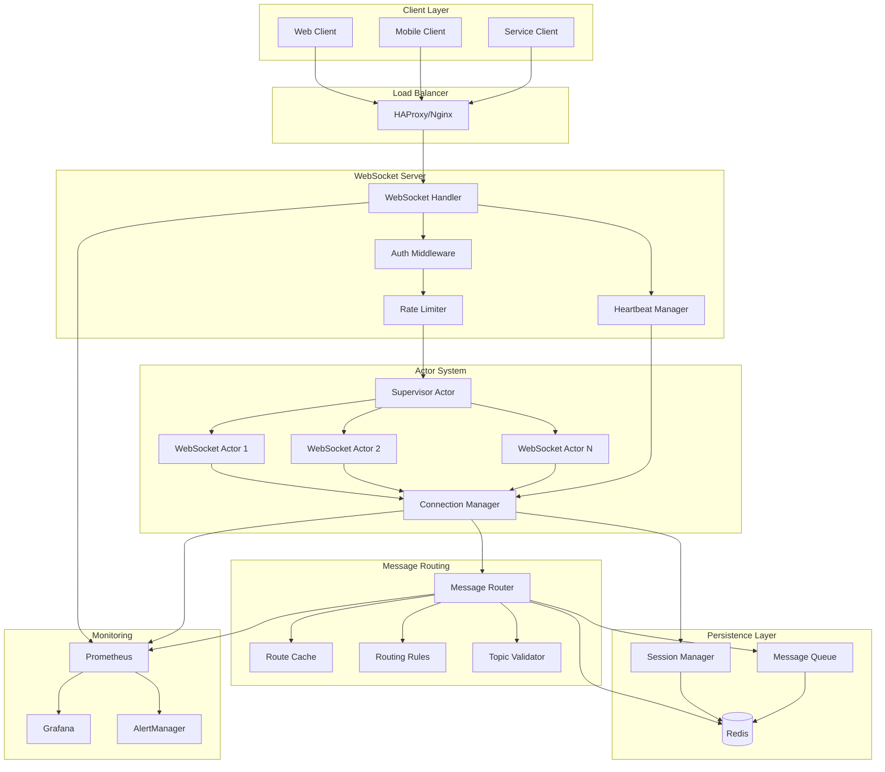
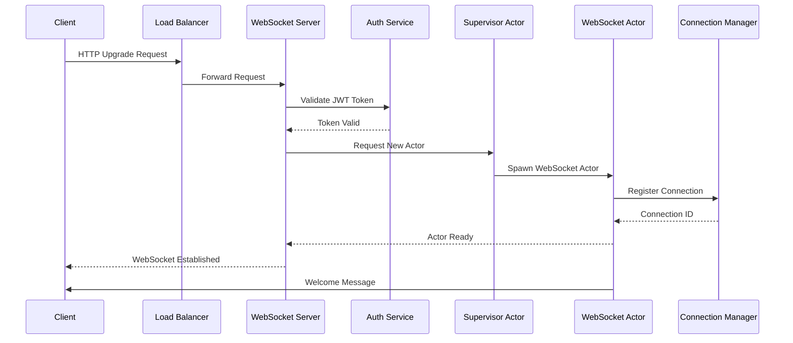
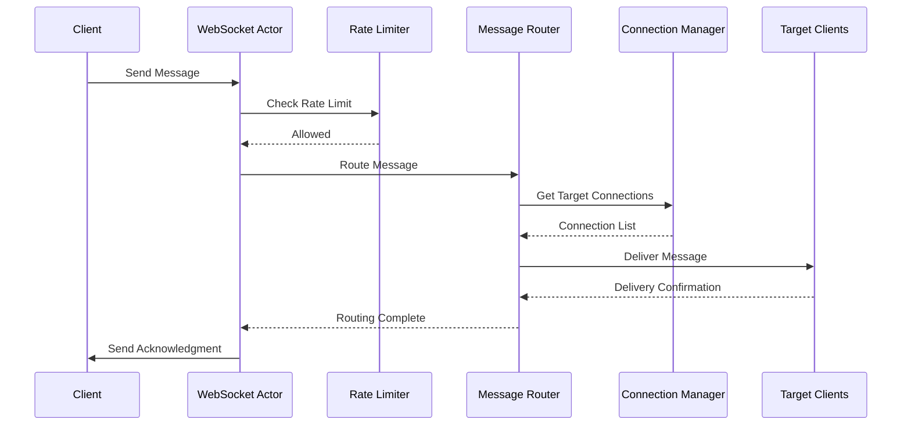
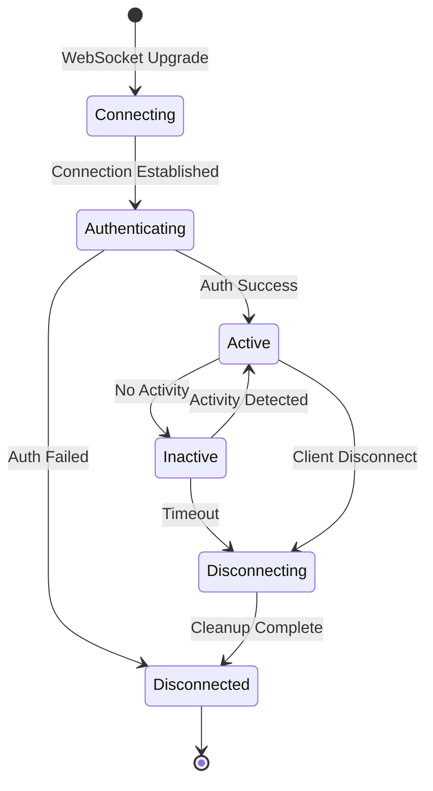
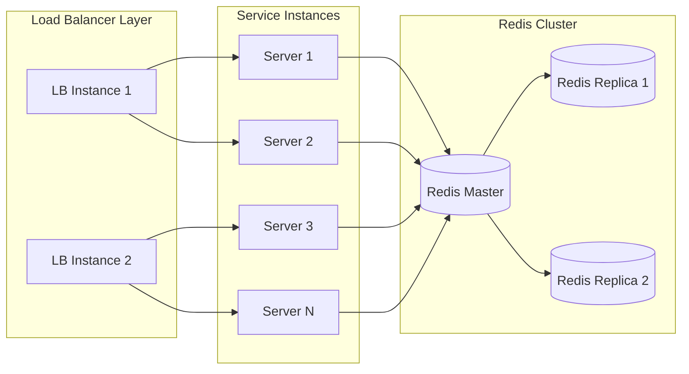

# Real-time Communication Service Architecture

## Overview

The Real-time Communication Service implements a highly scalable WebSocket-based messaging system using an actor model architecture. This design enables handling 10,000+ concurrent connections while maintaining low latency and high throughput.

## Architecture Diagram



## Actor Model Architecture

### Actor Hierarchy

```
                    System Supervisor
                           |
                    Server Actor
                    /      |      \
            Connection  Message   Metrics
            Supervisor  Router    Collector
                |         |          |
         WebSocket    Route      Stats
          Actors     Handlers   Aggregator
```

### Actor Types and Responsibilities

1. **System Supervisor**
   - Root actor supervising the entire system
   - Handles system-wide failures and restarts
   - Manages graceful shutdown

2. **Server Actor**
   - Manages HTTP server and WebSocket upgrades
   - Spawns connection supervisors
   - Handles server-level configuration

3. **Connection Supervisor**
   - Supervises all WebSocket actors
   - Implements restart strategies
   - Manages connection limits

4. **WebSocket Actor**
   - One actor per WebSocket connection
   - Handles message processing for a single client
   - Manages connection state and subscriptions
   - Isolated failure domain

5. **Message Router Actor**
   - Central message routing hub
   - Applies routing rules and filters
   - Manages topic subscriptions

## WebSocket Connection Lifecycle

### Connection Establishment



### Message Flow



## Message Routing System

### Routing Architecture

The message routing system implements a flexible, rule-based approach:

1. **Topic-based Routing**
   - Hierarchical topic structure (e.g., `system.notifications.alert`)
   - Wildcard subscriptions supported (`system.*`, `*.alert`)
   - Topic validation and normalization

2. **Direct Routing**
   - User-to-user messaging
   - Connection-specific targeting
   - Presence-aware routing

3. **Broadcast Routing**
   - Room/channel broadcasts
   - Global announcements
   - Filtered broadcasts

### Routing Rules Engine

```rust
pub struct RoutingRule {
    pub name: String,
    pub condition: RuleCondition,
    pub target_filter: Option<TargetFilter>,
    pub message_transform: Option<Transform>,
    pub priority: i32,
}
```

## Session Management Design

### Session States



### Session Persistence

- Sessions stored in Redis with TTL
- Automatic session recovery on reconnection
- Message replay for missed messages
- Presence tracking across multiple connections

## Scaling Architecture

### Horizontal Scaling



### Scaling Strategies

1. **Connection Distribution**
   - Sticky sessions via consistent hashing
   - Connection migration support
   - Load-based routing

2. **Message Distribution**
   - Redis pub/sub for cross-instance messaging
   - Sharded topics for high-volume channels
   - Local delivery optimization

3. **State Distribution**
   - Distributed session storage in Redis
   - Connection registry sharding
   - Eventual consistency for presence

## High Concurrency Design

### Concurrency Model

1. **Actor Isolation**
   - Each connection runs in isolated actor
   - No shared mutable state
   - Message passing for communication

2. **Async I/O**
   - Tokio runtime with work-stealing scheduler
   - Non-blocking I/O operations
   - Efficient task scheduling

3. **Lock-Free Data Structures**
   - DashMap for concurrent hash maps
   - Arc<RwLock> for shared state
   - Atomic operations for counters

### Performance Optimizations

1. **Connection Pooling**
   - Redis connection pooling
   - HTTP client connection reuse
   - Database connection management

2. **Message Batching**
   - Batch small messages together
   - Nagle's algorithm for TCP
   - Configurable batch windows

3. **Zero-Copy Operations**
   - Efficient buffer management
   - Direct memory access
   - Minimal allocations

## Failure Handling

### Actor Supervision Strategies

1. **One-for-One**
   - Individual actor restart
   - Isolated failure domains
   - Used for WebSocket actors

2. **All-for-One**
   - Restart all children
   - Used for critical subsystems
   - Applied to routing components

3. **Rest-for-One**
   - Restart failed and subsequent
   - Ordered dependency handling
   - Used for pipeline actors

### Circuit Breaker Pattern

```rust
pub struct CircuitBreaker {
    pub failure_threshold: u32,
    pub success_threshold: u32,
    pub timeout: Duration,
    pub state: CircuitState,
}

pub enum CircuitState {
    Closed,      // Normal operation
    Open,        // Failing, reject requests
    HalfOpen,    // Testing recovery
}
```

## Security Architecture

### Authentication Flow

1. **JWT Validation**
   - Token extraction from multiple sources
   - Signature verification
   - Claims validation

2. **Authorization**
   - Role-based access control (RBAC)
   - Permission checking
   - Resource-level authorization

3. **Connection Security**
   - TLS/SSL encryption
   - Origin validation
   - CSRF protection

## Monitoring and Observability

### Metrics Collection

1. **Connection Metrics**
   - Active connections
   - Connection rate
   - Connection duration

2. **Message Metrics**
   - Messages per second
   - Message latency
   - Routing performance

3. **System Metrics**
   - CPU and memory usage
   - Actor mailbox sizes
   - Error rates

### Distributed Tracing

- OpenTelemetry integration
- Request correlation IDs
- Cross-service tracing
- Performance profiling