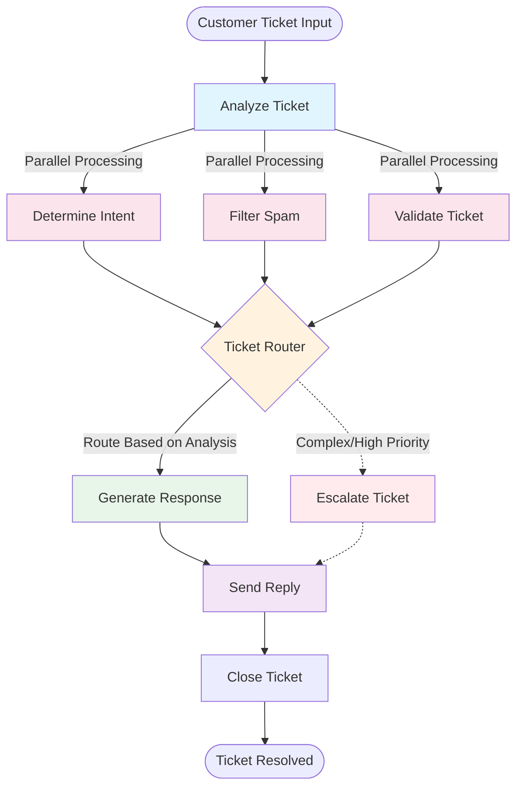
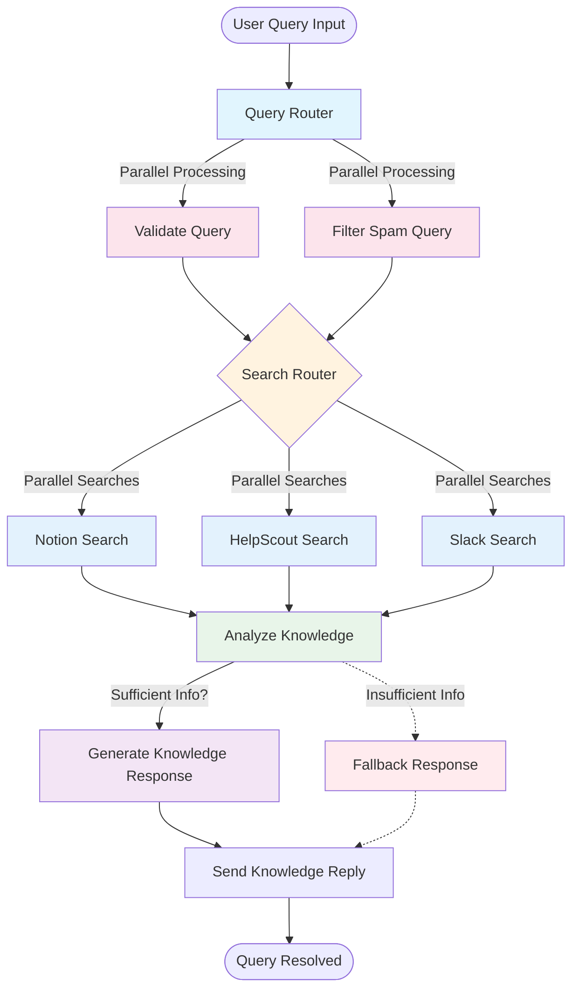

# AI System Workflow Diagrams

## Customer Support Workflow

### Workflow Details:
- **Entry Point**: Analyze Ticket - Extracts key information and triggers parallel processing
- **Parallel Tasks**: Intent determination, spam filtering, and validation run simultaneously
- **Router Node**: Makes intelligent routing decisions based on analysis results
- **Response Path**: Generates AI-powered responses and sends them to customers
- **Escalation Path**: Complex issues can be routed for manual handling

## Knowledge Base Workflow

### Workflow Details:
- **Entry Point**: Query Router - Processes user queries and extracts keywords
- **Validation**: Parallel query validation and spam filtering
- **Search Router**: Orchestrates parallel searches across multiple knowledge sources
- **Knowledge Sources**: Searches Notion, HelpScout, and Slack simultaneously
- **Analysis**: Evaluates search results for completeness and relevance
- **Response Generation**: Creates comprehensive responses with source attribution

## Node Execution Patterns

### Customer Support Workflow Nodes

| Node | Type | Purpose | Execution Time |
|------|------|---------|----------------|
| AnalyzeTicket | Entry | Initial ticket analysis | ~100ms |
| DetermineIntent | Parallel | AI intent classification | ~500ms |
| FilterSpam | Parallel | Spam detection | ~200ms |
| ValidateTicket | Parallel | Data validation | ~50ms |
| TicketRouter | Router | Decision routing | ~10ms |
| GenerateResponse | Sequential | AI response generation | ~1000ms |
| SendReply | Sequential | Response delivery | ~200ms |

### Knowledge Base Workflow Nodes

| Node | Type | Purpose | Execution Time |
|------|------|---------|----------------|
| QueryRouter | Entry | Query preparation | ~50ms |
| ValidateQuery | Parallel | Query validation | ~50ms |
| FilterSpamQuery | Parallel | Spam detection | ~100ms |
| SearchRouter | Router | Search orchestration | ~10ms |
| NotionSearch | Parallel | Notion API search | ~2000ms |
| HelpscoutSearch | Parallel | HelpScout search | ~1500ms |
| SlackSearch | Parallel | Slack search | ~3000ms |
| AnalyzeKnowledge | Sequential | Result analysis | ~500ms |
| GenerateKnowledgeResponse | Sequential | Response synthesis | ~1000ms |
| SendKnowledgeReply | Sequential | Response delivery | ~200ms |

## Key Differences

### Customer Support Workflow
- **Focus**: Ticket processing and customer service automation
- **Inputs**: Support tickets with customer messages
- **Outputs**: Generated responses and ticket status updates
- **Use Cases**: Customer inquiries, technical support, billing questions

### Knowledge Base Workflow
- **Focus**: Multi-source knowledge search and retrieval
- **Inputs**: User queries for information
- **Outputs**: Comprehensive responses from multiple sources
- **Use Cases**: Documentation search, FAQ retrieval, team knowledge mining

## Performance Characteristics

### Parallelization Benefits
- Customer Support: Reduces processing from ~3s to ~1s per ticket
- Knowledge Base: Reduces search time from ~15s to ~5s per query

### Scalability
- Both workflows handle multiple requests concurrently
- Node-level parallelization for improved throughput
- Connection pooling for external service integration