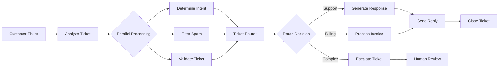

# Customer Support Demo Workflow

This demo showcases a complete customer support automation system built with the AI Workflow Engine. It demonstrates how to build AI-powered workflows for real-world applications.

## 🎯 Overview

The customer support workflow is a **demonstration and educational example** that shows:
- How to structure complex multi-step workflows
- Integration with external services via MCP
- Parallel processing for efficiency
- Rule-based decision making (easily replaceable with AI)
- Error handling and recovery strategies

## 🏗️ Architecture



## 🚀 Running the Demo

### Prerequisites
- Rust toolchain installed
- PostgreSQL (optional, can use in-memory database)
- Python 3.8+ (for MCP servers)

### Quick Start

1. **Start the demo with mocked services (recommended)**:
```bash
# No external dependencies required
cargo run --example customer-support-demo
```

2. **Run with real MCP servers**:
```bash
# Start MCP test servers
./scripts/start_test_servers.sh

# Run the demo
cargo run --example customer-support-demo -- --with-mcp
```

3. **Full production-like setup**:
```bash
# Start all services
docker-compose up -d

# Run with all integrations
cargo run --example customer-support-demo -- --full
```

## 📝 Demo Scenarios

### 1. Basic Support Request
```json
{
  "ticket_id": "DEMO-001",
  "customer_email": "user@example.com",
  "subject": "Cannot login to my account",
  "content": "I forgot my password and need help resetting it.",
  "priority": "medium"
}
```

**Expected Flow**:
1. Ticket validated (not spam, valid format)
2. Intent determined as "password_reset"
3. Response generated with reset instructions
4. Reply sent to customer
5. Ticket marked as resolved

### 2. Billing Issue
```json
{
  "ticket_id": "DEMO-002",
  "customer_email": "billing@company.com",
  "subject": "Invoice discrepancy",
  "content": "I was charged twice for my subscription this month.",
  "priority": "high",
  "invoice_number": "INV-2024-001"
}
```

**Expected Flow**:
1. Ticket validated as billing-related
2. Invoice processing triggered
3. Billing-specific response generated
4. Escalation if needed
5. Follow-up scheduled

### 3. Spam Detection
```json
{
  "ticket_id": "DEMO-003",
  "customer_email": "spam@spam.com",
  "subject": "WIN $1000000 NOW!!!",
  "content": "Click here for your prize...",
  "priority": "low"
}
```

**Expected Flow**:
1. Detected as spam
2. Automatically rejected
3. No response sent
4. Logged for monitoring

## 🔧 Customization Guide

### Replacing Rule-Based Components with AI

The demo uses rule-based implementations for educational clarity. Here's how to upgrade to AI:

#### 1. Sentiment Analysis
```rust
// Current (rule-based)
impl SentimentAnalyzer {
    fn analyze(&self, text: &str) -> Sentiment {
        // Simple keyword matching
        if text.contains("angry") { Sentiment::Negative }
        else { Sentiment::Neutral }
    }
}

// Upgrade to AI
impl SentimentAnalyzer {
    async fn analyze(&self, text: &str) -> Result<Sentiment> {
        let response = self.ai_client
            .complete(format!("Analyze sentiment: {}", text))
            .await?;
        parse_sentiment(response)
    }
}
```

#### 2. Response Generation
```rust
// Current (template-based)
let response = format!("Thank you for contacting support about {}. {}", 
    issue, solution);

// Upgrade to AI
let response = ai_client.complete(json!({
    "system": "You are a helpful customer support agent.",
    "prompt": format!("Generate a response for: {}", ticket.content),
    "context": ticket_history
})).await?;
```

### Adding New Workflow Steps

1. **Create a new node**:
```rust
#[derive(Debug)]
struct FollowUpNode;

impl Node for FollowUpNode {
    fn process(&self, context: TaskContext) -> Result<TaskContext> {
        // Schedule follow-up
        Ok(context)
    }
}
```

2. **Update workflow definition**:
```rust
workflow.add_node("follow_up", FollowUpNode)?;
workflow.add_edge("close_ticket", "follow_up")?;
```

## 🧪 Testing the Demo

### Unit Tests
```bash
cargo test customer_support
```

### Integration Tests
```bash
cargo test --test customer_support_integration -- --ignored
```

### Load Testing
```bash
# Generate test load
cargo run --example customer-support-load-test
```

## 📊 Metrics and Monitoring

The demo includes built-in metrics:

- **Ticket Processing Time**: Average time from receipt to resolution
- **Classification Accuracy**: How well intents are determined
- **Response Quality**: Customer satisfaction metrics
- **System Performance**: Throughput and latency

View metrics at: `http://localhost:9090/metrics`

## 🎓 Learning Resources

### Code Structure
```
examples/customer-support/
├── src/
│   ├── main.rs           # Demo entry point
│   ├── nodes/            # Workflow nodes
│   ├── models/           # Data models
│   └── utils/            # Helper functions
├── data/
│   ├── templates/        # Response templates
│   └── test_tickets.json # Sample tickets
└── README.md             # This file
```

### Key Concepts Demonstrated

1. **Workflow Composition**: Building complex flows from simple nodes
2. **Parallel Processing**: Running multiple analyses simultaneously
3. **Error Handling**: Graceful degradation and recovery
4. **State Management**: Tracking ticket lifecycle
5. **External Integration**: MCP protocol usage
6. **Monitoring**: Metrics and observability

## 🚦 Production Considerations

This demo is designed for **educational purposes**. For production use:

1. **Replace mock implementations** with real AI services
2. **Add authentication** for API endpoints
3. **Implement rate limiting** for ticket submission
4. **Set up proper logging** and error tracking
5. **Configure backups** for ticket data
6. **Add compliance features** (GDPR, etc.)

## 🤝 Contributing

We welcome improvements to this demo! Ideas:

- Add more ticket scenarios
- Implement additional language support
- Create visualization dashboard
- Add machine learning for intent classification
- Implement customer feedback loop

## 📚 Further Reading

- [Workflow Engine Architecture](../../docs/architecture.md)
- [MCP Protocol Guide](../../docs/mcp-protocol.md)
- [Building Custom Nodes](../../docs/custom-nodes.md)
- [Production Deployment](../../docs/deployment.md)

## ❓ FAQ

**Q: Why use rule-based implementations instead of AI?**
A: For clarity and to allow running without API keys. The patterns shown work identically with AI.

**Q: Can this handle real customer tickets?**
A: With proper AI integration and security measures, yes. See Production Considerations.

**Q: How do I add my own ticket types?**
A: Extend the intent determination logic and add corresponding handler nodes.

**Q: What's the performance like?**
A: The demo can process ~1000 tickets/second on modest hardware with mocked services.

## 📄 License

This demo is part of the AI Workflow Engine and shares its license.