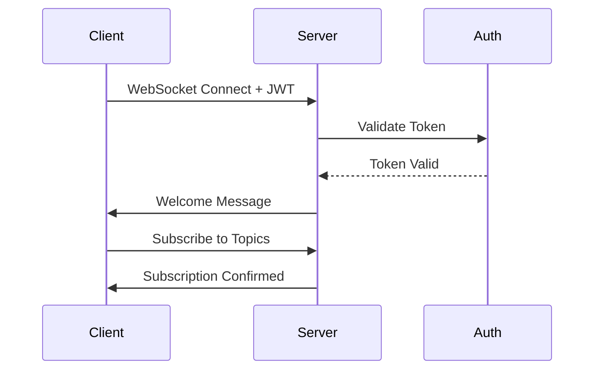

# WebSocket Protocol Reference

## Overview

The Real-time Communication Service uses a JSON-based protocol over WebSocket for all client-server communication. This document defines the message format, command types, and communication patterns.

## Connection Protocol

### WebSocket Endpoint

```
ws://localhost:8081/ws
wss://your-domain.com/ws (production with TLS)
```

### Authentication Methods

1. **Query Parameter**
   ```
   ws://localhost:8081/ws?token=<JWT_TOKEN>
   ```

2. **Authorization Header** (for HTTP upgrade request)
   ```
   Authorization: Bearer <JWT_TOKEN>
   ```

3. **WebSocket Subprotocol**
   ```javascript
   new WebSocket(url, ['access_token.<JWT_TOKEN>'])
   ```

## Message Format

All messages follow a consistent JSON structure:

```typescript
interface Message {
  type: string;      // Message type identifier
  data: any;         // Message payload
  id?: string;       // Optional message ID for tracking
  timestamp?: number; // Optional client timestamp
}
```

## Command Types

### Client to Server Messages

#### 1. Ping/Pong (Heartbeat)

**Request:**
```json
{
  "type": "Ping",
  "data": {
    "timestamp": 1234567890
  }
}
```

**Response:**
```json
{
  "type": "Pong",
  "data": {
    "timestamp": 1234567890
  }
}
```

#### 2. Subscribe to Topics

**Request:**
```json
{
  "type": "Subscribe",
  "data": {
    "topics": ["notifications", "chat.general", "updates.*"]
  }
}
```

**Response:**
```json
{
  "type": "Status",
  "data": {
    "status": "subscribed",
    "details": {
      "topics": ["notifications", "chat.general", "updates.*"],
      "active_subscriptions": 3
    }
  }
}
```

#### 3. Unsubscribe from Topics

**Request:**
```json
{
  "type": "Unsubscribe",
  "data": {
    "topics": ["chat.general"]
  }
}
```

**Response:**
```json
{
  "type": "Status",
  "data": {
    "status": "unsubscribed",
    "details": {
      "topics": ["chat.general"],
      "active_subscriptions": 2
    }
  }
}
```

#### 4. Broadcast Message

**Request:**
```json
{
  "type": "Broadcast",
  "data": {
    "topic": "chat.general",
    "payload": {
      "message": "Hello everyone!",
      "sender": "user123",
      "metadata": {
        "mood": "happy"
      }
    }
  },
  "id": "msg_123456"
}
```

**Response:**
```json
{
  "type": "Ack",
  "data": {
    "message_id": "msg_123456",
    "status": "delivered",
    "recipients": 42
  }
}
```

#### 5. Direct Message

**Request:**
```json
{
  "type": "DirectMessage",
  "data": {
    "target_user": "user456",
    "payload": {
      "message": "Private message",
      "attachments": []
    }
  },
  "id": "dm_789012"
}
```

**Response (Success):**
```json
{
  "type": "Ack",
  "data": {
    "message_id": "dm_789012",
    "status": "delivered",
    "delivered_to": ["conn_abc123", "conn_def456"]
  }
}
```

**Response (User Offline):**
```json
{
  "type": "Error",
  "data": {
    "code": 404,
    "message": "User user456 not found or not connected",
    "details": {
      "message_id": "dm_789012",
      "queued": true
    }
  }
}
```

### Server to Client Messages

#### 1. Welcome Message

Sent immediately after successful connection:

```json
{
  "type": "Status",
  "data": {
    "status": "connected",
    "details": {
      "connection_id": "550e8400-e29b-41d4-a716-446655440000",
      "server_time": 1234567890,
      "protocol_version": "1.0",
      "features": ["broadcast", "direct_message", "presence", "history"]
    }
  }
}
```

#### 2. Broadcast Delivery

When receiving a broadcast message:

```json
{
  "type": "Broadcast",
  "data": {
    "topic": "chat.general",
    "payload": {
      "message": "Hello everyone!",
      "sender": "user123",
      "metadata": {
        "mood": "happy"
      }
    },
    "metadata": {
      "sent_at": 1234567890,
      "message_id": "broadcast_123456"
    }
  }
}
```

#### 3. Direct Message Delivery

When receiving a direct message:

```json
{
  "type": "DirectMessage",
  "data": {
    "from_user": "user123",
    "payload": {
      "message": "Private message",
      "attachments": []
    },
    "metadata": {
      "sent_at": 1234567890,
      "message_id": "dm_123456"
    }
  }
}
```

#### 4. System Notifications

Server-initiated notifications:

```json
{
  "type": "Notification",
  "data": {
    "level": "info",
    "title": "Maintenance Notice",
    "message": "System will undergo maintenance in 1 hour",
    "actions": [
      {
        "label": "Learn More",
        "url": "https://status.example.com"
      }
    ]
  }
}
```

#### 5. Presence Updates

User presence changes:

```json
{
  "type": "Presence",
  "data": {
    "user_id": "user789",
    "status": "online",
    "last_seen": 1234567890,
    "metadata": {
      "device": "web",
      "location": "New York"
    }
  }
}
```

## Error Message Format

All errors follow a consistent structure:

```json
{
  "type": "Error",
  "data": {
    "code": 400,
    "message": "Human-readable error message",
    "details": {
      "field": "additional",
      "context": "information"
    }
  }
}
```

### Error Codes

| Code | Description | Action |
|------|-------------|--------|
| 400 | Bad Request | Check message format |
| 401 | Unauthorized | Reauthenticate |
| 403 | Forbidden | Check permissions |
| 404 | Not Found | Verify resource exists |
| 429 | Rate Limited | Retry after delay |
| 500 | Internal Error | Retry with backoff |
| 503 | Service Unavailable | Retry later |

## Authentication Handshake

### Initial Connection



### Token Refresh Flow

When the server detects a token nearing expiration:

```json
{
  "type": "AuthStatus",
  "data": {
    "status": "token_expiring",
    "expires_at": 1234567890,
    "refresh_required": true
  }
}
```

Client should obtain a new token and reconnect.

## Client Implementation Guide

### Basic TypeScript Client

```typescript
interface WSMessage {
  type: string;
  data: any;
  id?: string;
  timestamp?: number;
}

class RealtimeProtocolClient {
  private ws: WebSocket | null = null;
  private messageHandlers: Map<string, (data: any) => void> = new Map();
  private pendingAcks: Map<string, (response: any) => void> = new Map();
  private messageCounter = 0;

  constructor(private url: string, private token: string) {
    this.setupDefaultHandlers();
  }

  private setupDefaultHandlers() {
    // Handle connection status
    this.on('Status', (data) => {
      console.log('Status update:', data);
    });

    // Handle errors
    this.on('Error', (data) => {
      console.error('Server error:', data);
    });

    // Handle pings
    this.on('Ping', (data) => {
      this.send('Pong', { timestamp: data.timestamp });
    });
  }

  connect(): Promise<void> {
    return new Promise((resolve, reject) => {
      this.ws = new WebSocket(`${this.url}?token=${this.token}`);

      this.ws.onopen = () => {
        console.log('WebSocket connected');
        resolve();
      };

      this.ws.onmessage = (event) => {
        const message: WSMessage = JSON.parse(event.data);
        this.handleMessage(message);
      };

      this.ws.onerror = (error) => {
        console.error('WebSocket error:', error);
        reject(error);
      };

      this.ws.onclose = () => {
        console.log('WebSocket disconnected');
        this.handleDisconnect();
      };
    });
  }

  private handleMessage(message: WSMessage) {
    // Handle acknowledgments
    if (message.type === 'Ack' && message.data.message_id) {
      const handler = this.pendingAcks.get(message.data.message_id);
      if (handler) {
        handler(message.data);
        this.pendingAcks.delete(message.data.message_id);
        return;
      }
    }

    // Handle regular messages
    const handler = this.messageHandlers.get(message.type);
    if (handler) {
      handler(message.data);
    } else {
      console.warn('Unhandled message type:', message.type);
    }
  }

  on(type: string, handler: (data: any) => void) {
    this.messageHandlers.set(type, handler);
  }

  send(type: string, data: any, expectAck = false): Promise<any> {
    const message: WSMessage = {
      type,
      data,
      id: expectAck ? `msg_${++this.messageCounter}` : undefined,
      timestamp: Date.now()
    };

    if (this.ws?.readyState === WebSocket.OPEN) {
      this.ws.send(JSON.stringify(message));

      if (expectAck && message.id) {
        return new Promise((resolve) => {
          this.pendingAcks.set(message.id, resolve);
          
          // Timeout after 30 seconds
          setTimeout(() => {
            if (this.pendingAcks.has(message.id!)) {
              this.pendingAcks.delete(message.id!);
              resolve({ error: 'Acknowledgment timeout' });
            }
          }, 30000);
        });
      }
    }

    return Promise.resolve();
  }

  subscribe(topics: string[]): Promise<any> {
    return this.send('Subscribe', { topics }, true);
  }

  broadcast(topic: string, payload: any): Promise<any> {
    return this.send('Broadcast', { topic, payload }, true);
  }

  sendDirectMessage(targetUser: string, payload: any): Promise<any> {
    return this.send('DirectMessage', { target_user: targetUser, payload }, true);
  }

  private handleDisconnect() {
    // Clear pending acknowledgments
    this.pendingAcks.clear();
    
    // Implement reconnection logic
    console.log('Implementing reconnection...');
  }

  disconnect() {
    if (this.ws) {
      this.ws.close();
      this.ws = null;
    }
  }
}

// Usage example
async function main() {
  const client = new RealtimeProtocolClient('ws://localhost:8081/ws', 'your-jwt-token');
  
  // Set up message handlers
  client.on('Broadcast', (data) => {
    console.log('Received broadcast:', data);
  });

  client.on('DirectMessage', (data) => {
    console.log('Received DM from', data.from_user, ':', data.payload);
  });

  // Connect and use
  await client.connect();
  
  // Subscribe to topics
  const subResult = await client.subscribe(['chat.general', 'notifications']);
  console.log('Subscription result:', subResult);
  
  // Send a broadcast
  const broadcastResult = await client.broadcast('chat.general', {
    message: 'Hello from TypeScript client!'
  });
  console.log('Broadcast result:', broadcastResult);
}
```

## Binary Protocol Support

For high-performance scenarios, binary messages are supported:

### Binary Message Format

```
[1 byte: message type][4 bytes: payload length][N bytes: payload]
```

Message types:
- `0x01`: Binary broadcast
- `0x02`: Binary direct message
- `0x03`: Binary file transfer
- `0x04`: Binary stream data

### Binary Response

Server acknowledges binary messages with:

```json
{
  "type": "Status",
  "data": {
    "status": "binary_received",
    "details": {
      "size": 1024,
      "type": "file_transfer",
      "checksum": "sha256:..."
    }
  }
}
```

## Protocol Extensions

### Custom Message Types

Clients can register custom message types with the `X-` prefix:

```json
{
  "type": "X-CustomAction",
  "data": {
    "action": "special_operation",
    "parameters": {}
  }
}
```

### Metadata Headers

Additional metadata can be included in any message:

```json
{
  "type": "Broadcast",
  "data": { ... },
  "metadata": {
    "priority": "high",
    "ttl": 3600,
    "encryption": "aes256",
    "compression": "gzip"
  }
}
```

## Best Practices

1. **Message IDs**: Always include message IDs for operations requiring acknowledgment
2. **Heartbeat**: Send ping messages every 30 seconds to maintain connection
3. **Reconnection**: Implement exponential backoff for reconnection attempts
4. **Error Handling**: Always handle error messages appropriately
5. **Rate Limiting**: Respect rate limits and implement client-side throttling
6. **Message Size**: Keep messages under 64KB for optimal performance
7. **Compression**: Use compression for large payloads
8. **Batch Operations**: Group multiple operations when possible